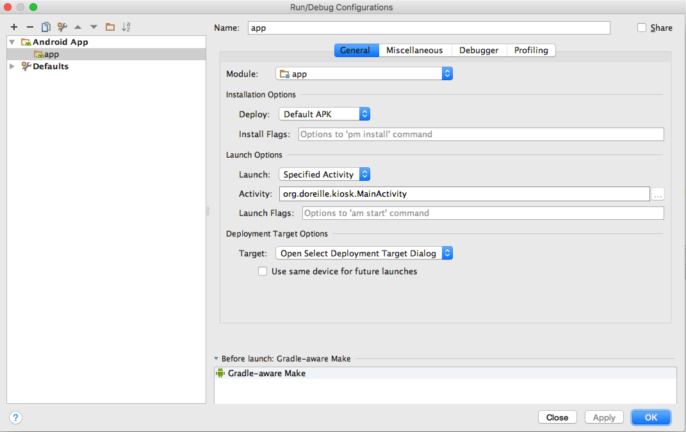

# Android Basic Kiosk

This code creates a basic kiosk on Android which creates a single application which owns your mobile or your tablet.

In fact, it's a skeleton to build a more complicated android application.

## Configure Android Studio

Go to the menu Run > Edit Configurations 

In the "Launch Options" relative to the folder App, choose "Specified Activity" for the option "Launch" and type the name of your activity in the option "Activity".

For the current skeleton, you provide this string "org.doreille.kiosk.MainActivity".

## Configure your tablet to protect the pinning

This skeleton uses the pinning mode of android available from the version 21 of the SDK (it means Android 5.0 ) .

To protect the pinning of the application, you need to configure this application as the device owner using the following ADB command line:

adb shell dpm set-device-owner org.doreille.kiosk/.receivers.AdminReceive

You couldn't use simultaneously a Google Play or a KNOX account.

